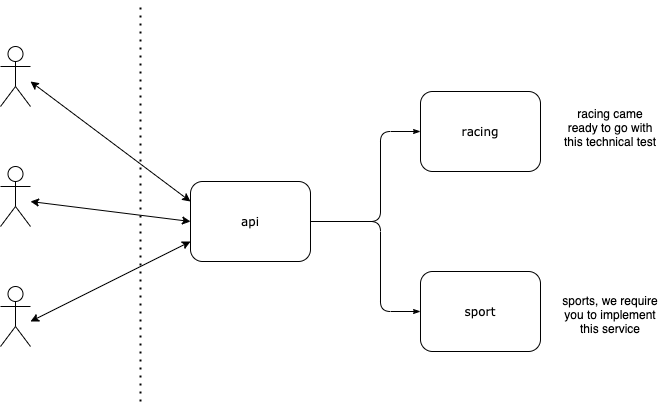

## Entain BE Technical Test

This test has been designed to demonstrate your ability and understanding of technologies commonly used at Entain. 

Please treat the services provided as if they would live in a real-world environment.

### Directory Structure

- `api`: A REST gateway that forwards requests to backend services (racing and sports).
- `racing`: A racing service that manages race data and provides gRPC APIs.
- `sports`: A sports service that manages sports events data and provides gRPC APIs.

```
entain/
├─ api/
│  ├─ proto/
│  │  ├─ racing/           # Racing service protobuf definitions
│  │  └─ sports/           # Sports service protobuf definitions
│  ├─ main.go
│  ├─ go.mod
├─ racing/
│  ├─ db/                  # Database layer for races
│  ├─ proto/               # Racing protobuf definitions
│  ├─ service/             # Racing business logic
│  ├─ internal/logger/     # Logging utilities
│  ├─ main.go
│  ├─ go.mod
├─ sports/
│  ├─ db/                  # Database layer for sports events
│  ├─ proto/               # Sports protobuf definitions
│  ├─ service/             # Sports business logic
│  ├─ internal/logger/     # Logging utilities
│  ├─ main.go
│  ├─ go.mod
├─ README.md
```

### Getting Started

#### Environment Variables

The services use the following environment variables for configuration:

- `LOG_LEVEL` - Controls logging level. Default: `info`
  - `debug` - Show all logs including debug information
  - `info` - Show info, warn, and error logs
  - `warn` - Show warn and error logs only
  - `error` - Show error logs only

- `ENVIRONMENT` - Controls deployment environment. Default: `production`
  - `development` or `dev` - Development mode with console output and colored logs
  - `production` or `prod` - Production mode with JSON formatted logs
  - `testing` or `test` - Testing mode with console output, no caller info

Example:
```bash
export LOG_LEVEL=debug
export ENVIRONMENT=development
```

1. Install Go (latest).

```bash
brew install go
```

... or [see here](https://golang.org/doc/install).

2. Install `protoc`

```
brew install protobuf
```

... or [see here](https://grpc.io/docs/protoc-installation/).

2. Start the racing service...

```bash
cd ./racing

go build && ./racing
➜ INFO[0000] gRPC server listening on: localhost:9000
```

3. Start the sports service...

```bash
cd ./sports

go build && ./sports
➜ INFO[0000] gRPC server listening on: localhost:9001
```

4. Start the API gateway service...

```bash
cd ./api

go build && ./api
➜ INFO[0000] API server listening on: localhost:8000
```

5. Make requests to test the services:

**List races:**
```bash
curl -X "POST" "http://localhost:8000/v1/list-races" \
     -H 'Content-Type: application/json' \
     -d $'{
  "filter": {}
}'
```

**Get a single race by ID:**
```bash
curl -X "GET" "http://localhost:8000/v1/races/1"
```

**List sports events:**
```bash
curl -X "POST" "http://localhost:8000/v1/list-events" \
     -H 'Content-Type: application/json' \
     -d $'{
  "filter": {}
}'
```

**Get a single sports event by ID:**
```bash
curl -X "GET" "http://localhost:8000/v1/events/1"
```

### Changes/Updates Required

- We'd like to see you push this repository up to **GitHub/Gitlab/Bitbucket** and lodge a **Pull/Merge Request for each** of the below tasks.
- This means, we'd end up with **5x PR's** in total. **Each PR should target the previous**, so they build on one-another.
- Alternatively you can merge each PR/MR after each other into master.
- This will allow us to review your changes as well as we possibly can.
- As your code will be reviewed by multiple people, it's preferred if the repository is **publicly accessible**. 
- If making the repository public is not possible; you may choose to create a separate account or ask us for multiple email addresses which you can then add as viewers. 

... and now to the test! Please complete the following tasks.

1. ✅ **Add another filter to the existing RPC** - Added `visible_only` filter to `ListRaces` RPC.
2. ✅ **Order races by advertised_start_time** - Implemented configurable sorting with `sort_field` and `sort_direction` options.
3. ✅ **Add status field** - Added `RaceStatus` enum with `OPEN`/`CLOSED` values derived from `advertised_start_time`.
4. ✅ **Introduce GetRace RPC** - Added `GetRace` RPC to fetch a single race by ID.
5. ✅ **Create sports service** - Implemented a complete sports service with similar API structure to racing.

> Note: this should be a separate service, not bolted onto the existing racing service. At an extremely high-level, the diagram below attempts to provide a visual representation showing the separation of services needed and flow of requests.
> 
> 


**Don't forget:**

> Document and comment! Please make sure your work is appropriately documented/commented, so fellow developers know whats going on.

### Services Overview

#### Racing Service
- **Port**: 9000 (gRPC)
- **Features**: 
  - List races with filtering (by meeting IDs, visibility)
  - Get single race by ID
  - Sorting by advertised start time, name, or number
  - Status calculation (OPEN/CLOSED based on start time)

#### Sports Service  
- **Port**: 9001 (gRPC)
- **Features**:
  - List sports events with filtering (by sport types, visibility)
  - Get single sports event by ID
  - Sorting by advertised start time, name, or sport type
  - Status calculation (OPEN/CLOSED based on start time)

#### API Gateway
- **Port**: 8000 (HTTP/REST)
- **Features**: 
  - REST endpoints for both racing and sports services
  - gRPC-Gateway for protocol translation
  - OpenAPI/Swagger documentation

### API Endpoints

#### Racing Endpoints
- `POST /v1/list-races` - List races with filtering and sorting
- `GET /v1/races/{id}` - Get race by ID

#### Sports Endpoints  
- `POST /v1/list-events` - List sports events with filtering and sorting
- `GET /v1/events/{id}` - Get sports event by ID

**Note:**

To aid in proto generation following any changes, you can run `go generate ./...` from `api`, `racing`, and `sports` directories.

Before you do so, please ensure you have the following installed. You can simply run the following command below in each of `api`, `racing`, and `sports` directories.

```
go install github.com/grpc-ecosystem/grpc-gateway/v2/protoc-gen-grpc-gateway github.com/grpc-ecosystem/grpc-gateway/v2/protoc-gen-openapiv2 google.golang.org/genproto/googleapis/api google.golang.org/grpc/cmd/protoc-gen-go-grpc google.golang.org/protobuf/cmd/protoc-gen-go
```

### Good Reading

- [Protocol Buffers](https://developers.google.com/protocol-buffers)
- [Google API Design](https://cloud.google.com/apis/design)
- [Go Modules](https://golang.org/ref/mod)
- [Ubers Go Style Guide](https://github.com/uber-go/guide/blob/2910ce2e11d0e0cba2cece2c60ae45e3a984ffe5/style.md)
